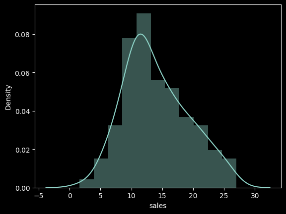
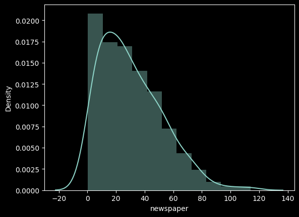
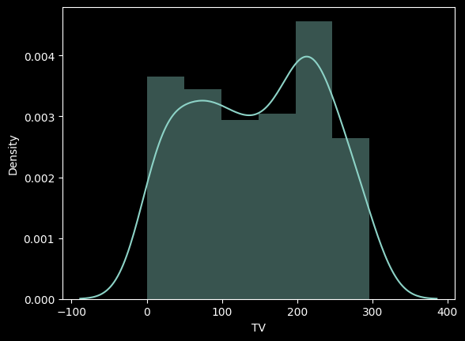
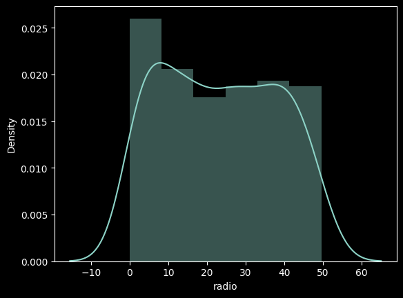
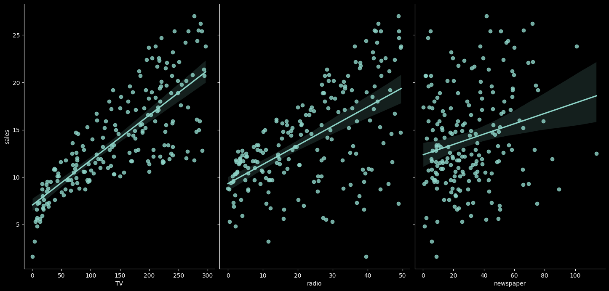
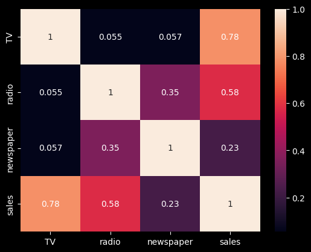

# Predict Sales Revenue with scikit-learn


## Introduction

In this project, we will build and evaluate a simple linear regression model using Python. We will employ the scikit-learn module for calculating the linear regression, while using pandas for data management and seaborn for plotting. We will be working with the very popular Advertising dataset to predict sales revenue based on advertising spending through mediums such as TV, radio, and newspaper.

Linear Regression is a useful tool for predicting a quantitative response. It assumes a linear relationship between the predictor variables and the response variable.

- Root Mean Squared Error : 12.24744871391589

-

### Loading the Data and Importing Libraries

```python
import pandas as pd
import numpy as np
from matplotlib import pyplot as plt
import seaborn as sns
```

The Advertising dataset captures sales revenue generated with respect to advertisement spending across multiple channels like radio, TV, and newspaper.

### Exploratory Data Analysis

```python
# Exploratory data analysis
...
```
- Sales to Density

  


- Newspaper to Density



- TV to Density



- Radio to Density



### Exploring Relationships between Predictors and Response

```python
# Visualizing relationships between predictors and response
...
```



### Creating the Simple Linear Regression Model

In our case, the linear regression model has the form:

$$
y = \beta_{0} + \beta_{1} \times TV + \beta_{2} \times Radio + \beta_{3} \times Newspaper
$$

The $\beta$ values are called the model coefficients, which are learned during the model fitting step using the least squares criterion.

```python
from sklearn.model_selection import train_test_split
from sklearn.linear_model import LinearRegression
```

### Interpreting Model Coefficients

```python
# Print model coefficients
...
```



### Making Predictions with our Model

```python
# Make predictions
...
```

### Model Evaluation Metrics

```python
from sklearn import metrics
```

- **Mean Absolute Error** (MAE)
- **Mean Squared Error** (MSE)
- **Root Mean Squared Error** (RMSE)

```python
# Calculate evaluation metrics
...
```

This project demonstrates the implementation of a simple linear regression model using scikit-learn. It covers data preprocessing, model training, prediction, and evaluation steps, providing insights into predicting sales revenue based on advertising spends across different channels.

```
